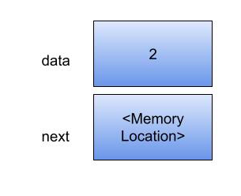

## Linked List
- Linked List is an implementation of List data structure
- Each element is linked to/reference its next element
- In a *singly linked list* we have forward refernce where each element has a reference to its next element
- Linked List is accessed via the very first element in the list called *Head*
- Last element in a Linked List points to null
- Each element in a linked list has a data/element and a pointer/reference to the next element (i.e, A single node in a linked list consists of data and a reference as in the below diagram



- In Java Node is implemented as a Generic class so that it can hold any data type
- The Data should implement comparable for equality checks for example to find the index of a particular element
- Java LinkedList maintains insertion order and implements List and Deque interface

```
public class Node<T extend Comparable<T>> {

  private T data;
  private Node<T> next;
  
  public Node(T data) {
    this.data = data;
    setNext(null);
  }

  public Node<T> getNext() {
    return next;
  }
  
  public void setNext(Node<T> next) {
    this.next = next;
  }
  
  public T getData() {
    return data;
  }
}
```

- For Linked list traversal, we traverse till a null is encountered


```
Node<String> current = head;
while(current != null) {
    current = current.getNext();
}
```
